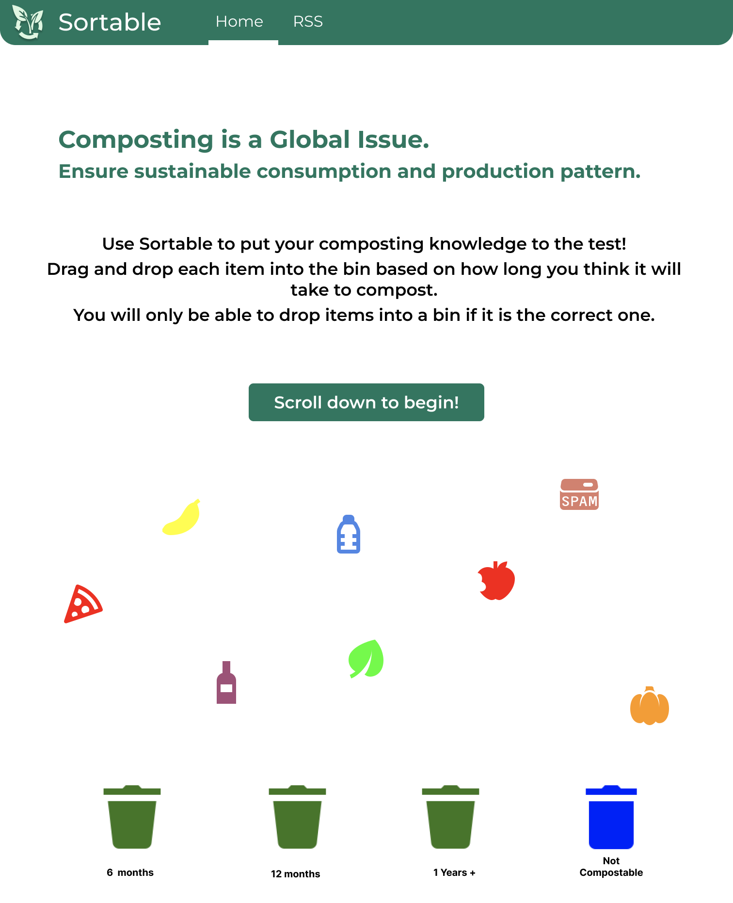
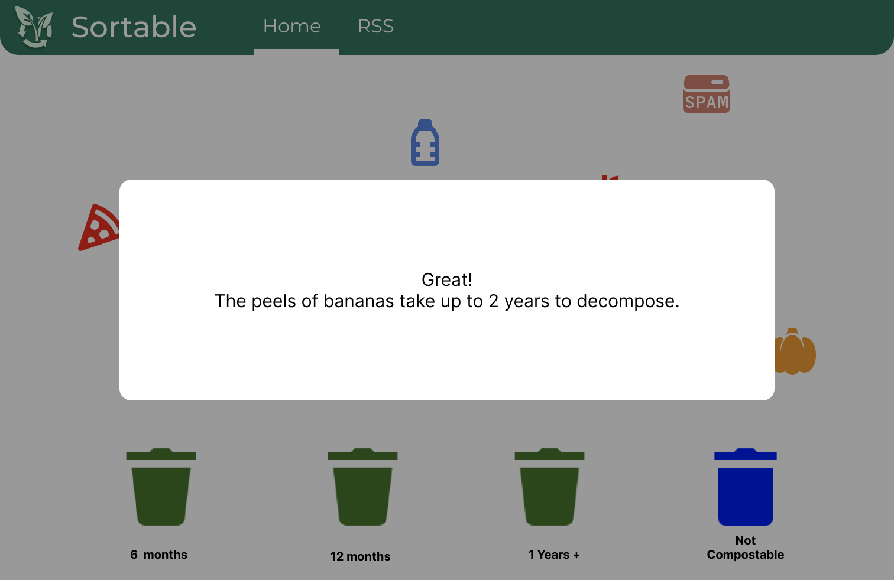
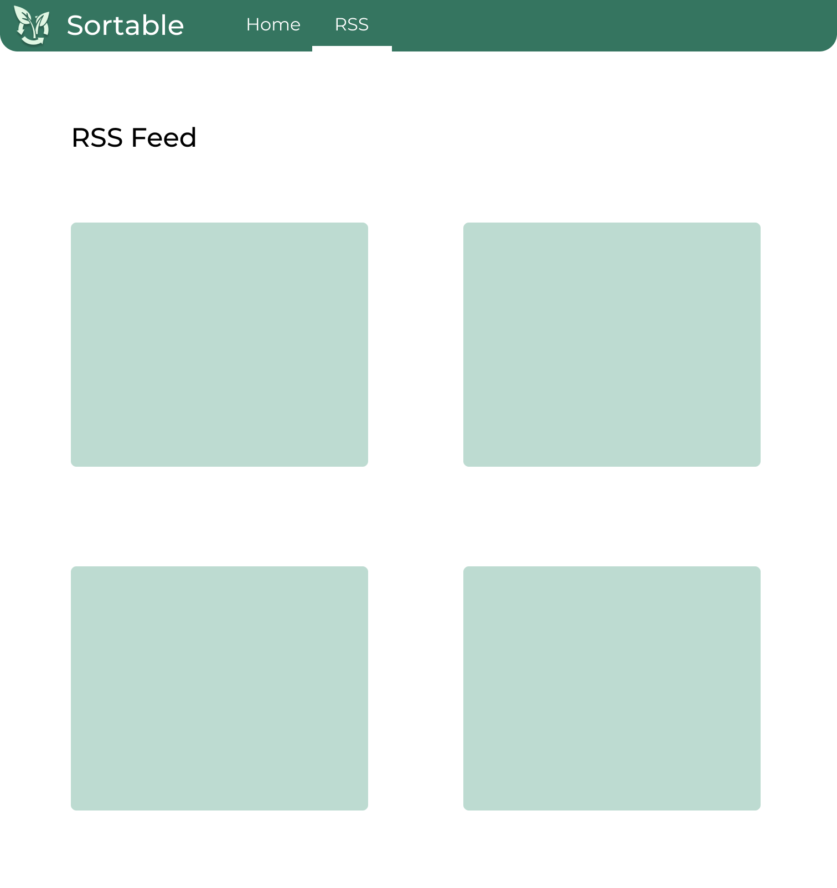

# _Sortable_

### Sortable is an interactive web app that aims to educate users on sustainable composting practices by gamifying the composting process. Users can play our sorting game in which they can drag and drop different items into categorized composting bins. The game will provide immediate feedback on the users decisions. 
#### This project was created for INFO 442 at the UW iSchool by team _Theatrical Techies (Group 7)_: 
* Cynthia Chung
* Youjin Jung
* Ryan Oh
* Evan Siu
* Brandon Wong

### Background Research and Problem Statement
Our group is focusing on SDG 12: “Ensure sustainable consumption and production patterns” for this project.
Based on our initial research, we found out that only 27 percent of people in the United States have access to some form of composting services. We believe that the low rates of composting come from poor efforts from within the city to offer easy and accessible methods of composting.

While Seattle is one of the most known cities that have the best recyclers in the nation, it is important to compost right and educate people on the importance of composting. By making sure sustainability consumption is properly managed in Seattle, we want to dive into the composting systems in Seattle and what consumers feeding it can do to improve upon it.

Our problem statement is: “HOW MIGHT WE better inform Seattle Citizens on city waste management processes to promote sorting and downstream sanitation in consumer households?”

### Interviews and User personas
Our group conducted three user interviews with close friends based in Seattle to understand their experience of composting as well as their motivations and behaviors on composting at home.

Based on our concrete findings, we defined two user personas: a UW undergraduate student and a 42-year-old marketing director based in Seattle. One of their key pain points is that they do not know the standard for composting and its process. In order to address their pain points, we brainstormed some features and prioritized them in the below section.

### Features and Prioritization
We initially brainstormed about eight features for our project and narrowed them down to two main features within the given time and scope of the project. Our two main features are 1) Drag and Drop Game and 2) RSS Feed.

Drag and Drop Game is a quiz-like structure where users are able to drag waste items and drop them into corresponding recycling bins. This game structure will engage a wide range of Seattle Citizens and educate them on compostable items and even the duration of the composting process.

RSS Feed is to users a handful of resources on recycling and composting. This will allow users to click on an article or blog they are interested in and learn about composting more in-depth. 

### Components and Testing Protocols

### Prototypes
Wireframes

Low-Fidelity Prototypes

### What Could be Improved / Next Steps
If we had more time, it would have been nice if users were able to add compost items on their end or upon their request for the Drag and Drop game. In addition, it would be beneficial to have the RSS Feed page updated automatically so that users can keep up with the most recent articles regarding compost and recycling.
